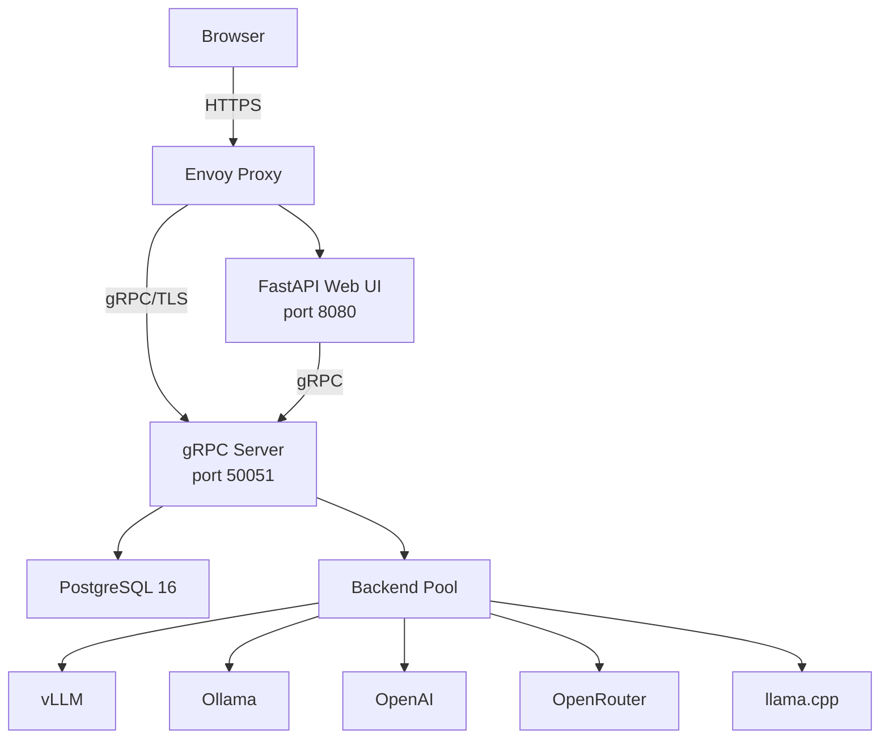
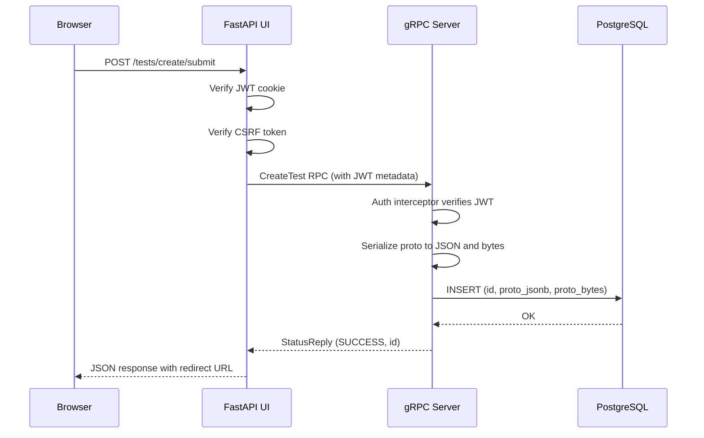
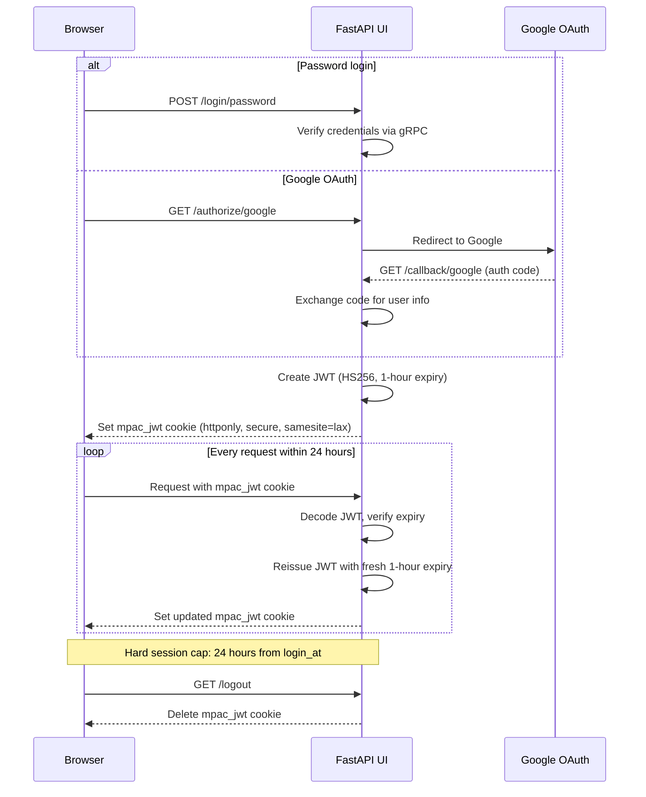
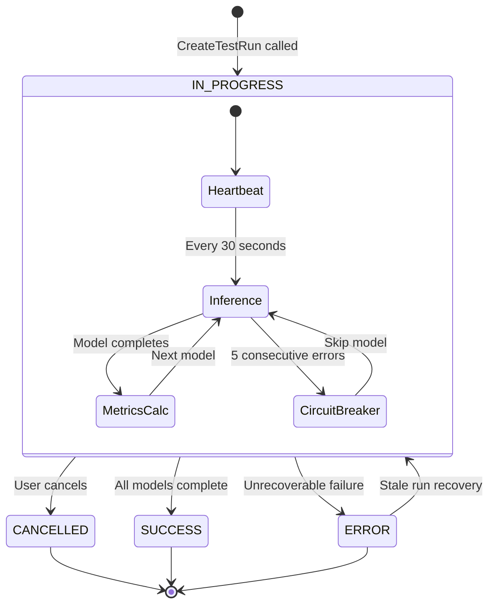
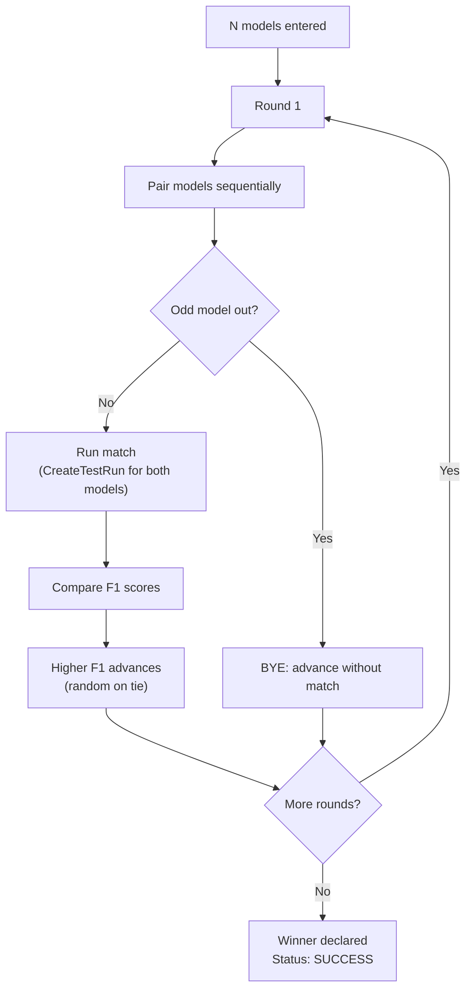
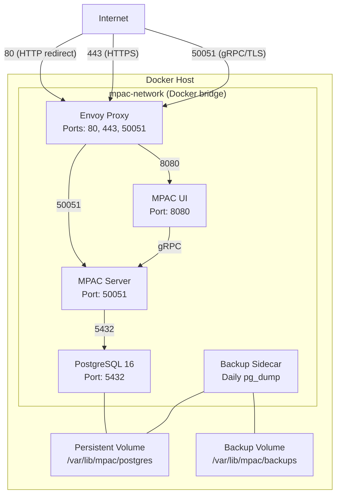
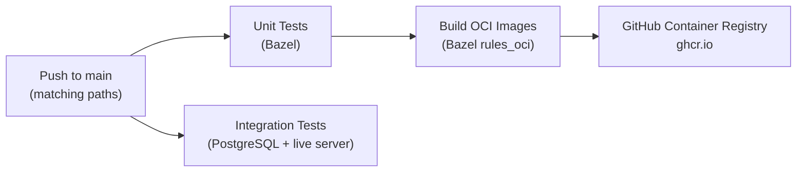

# MPAC Technical Guide

## Table of Contents

- [1 Overview](#1-overview)
  - [1.1 What MPAC Does](#11-what-mpac-does)
  - [1.2 System Components](#12-system-components)
  - [1.3 Key Terms](#13-key-terms)
- [2 Architecture](#2-architecture)
  - [2.1 Component Diagram](#21-component-diagram)
  - [2.2 gRPC Backend Server](#22-grpc-backend-server)
  - [2.3 Web UI](#23-web-ui)
  - [2.4 Database Schema](#24-database-schema)
  - [2.5 Data Flow](#25-data-flow)
- [3 Authentication and Access Control](#3-authentication-and-access-control)
  - [3.1 Authentication Methods](#31-authentication-methods)
  - [3.2 JWT Session Lifecycle](#32-jwt-session-lifecycle)
  - [3.3 CSRF Protection](#33-csrf-protection)
  - [3.4 Visibility Levels](#34-visibility-levels)
  - [3.5 User Roles](#35-user-roles)
- [4 Tests](#4-tests)
  - [4.1 Test Types: Evaluation and Survey](#41-test-types-evaluation-and-survey)
  - [4.2 Create a Test](#42-create-a-test)
  - [4.3 Edit a Test](#43-edit-a-test)
  - [4.4 Set Test Visibility](#44-set-test-visibility)
  - [4.5 Export a Test](#45-export-a-test)
  - [4.6 Import a Test from a ZIP Archive](#46-import-a-test-from-a-zip-archive)
  - [4.7 Delete a Test](#47-delete-a-test)
- [5 Runs](#5-runs)
  - [5.1 What a Run Does](#51-what-a-run-does)
  - [5.2 Configure a Run](#52-configure-a-run)
  - [5.3 Run Lifecycle](#53-run-lifecycle)
  - [5.4 Monitor a Run](#54-monitor-a-run)
  - [5.5 Cancel a Run](#55-cancel-a-run)
  - [5.6 View Run Results](#56-view-run-results)
  - [5.7 Export a PDF Report](#57-export-a-pdf-report)
  - [5.8 Delete a Run](#58-delete-a-run)
  - [5.9 Stale Run Recovery](#59-stale-run-recovery)
- [6 Benchmarks](#6-benchmarks)
  - [6.1 Tournament Format](#61-tournament-format)
  - [6.2 Create a Benchmark](#62-create-a-benchmark)
  - [6.3 Benchmark Lifecycle](#63-benchmark-lifecycle)
  - [6.4 View the Bracket](#64-view-the-bracket)
  - [6.5 Stale Benchmark Recovery](#65-stale-benchmark-recovery)
  - [6.6 Delete a Benchmark](#66-delete-a-benchmark)
- [7 Models and Backends](#7-models-and-backends)
  - [7.1 Model Catalog](#71-model-catalog)
  - [7.2 Backend Types](#72-backend-types)
  - [7.3 Local and Remote Backends](#73-local-and-remote-backends)
  - [7.4 Backend Pool and Concurrency](#74-backend-pool-and-concurrency)
  - [7.5 Register, Enable, Disable, or Delete a Backend (ADMIN)](#75-register-enable-disable-or-delete-a-backend-admin)
- [8 Metrics and Analytics](#8-metrics-and-analytics)
  - [8.1 Date Range and Filters](#81-date-range-and-filters)
  - [8.2 Leaderboard, Per-Test Breakdown, Daily Charts](#82-leaderboard-per-test-breakdown-daily-charts)
  - [8.3 DuckDB Analytics Engine](#83-duckdb-analytics-engine)
- [9 User Settings](#9-user-settings)
  - [9.1 Profile and Spend](#91-profile-and-spend)
  - [9.2 Mint an API Key](#92-mint-an-api-key)
- [10 Administration (ADMIN)](#10-administration-admin)
  - [10.1 First-Time Admin Onboarding](#101-first-time-admin-onboarding)
  - [10.2 Manage Users](#102-manage-users)
  - [10.3 Manage Backends](#103-manage-backends)
  - [10.4 Rate Limiting](#104-rate-limiting)
- [11 Deployment: On-Premises Docker (ADMIN)](#11-deployment-on-premises-docker-admin)
  - [11.1 Prerequisites](#111-prerequisites)
  - [11.2 Deployment Topology](#112-deployment-topology)
  - [11.3 Terraform Variables](#113-terraform-variables)
  - [11.4 Deploy Procedure](#114-deploy-procedure)
  - [11.5 Envoy Proxy Configuration](#115-envoy-proxy-configuration)
  - [11.6 Database Backups](#116-database-backups)
  - [11.7 Upgrade Procedure](#117-upgrade-procedure)
- [12 CI/CD Pipeline (ADMIN)](#12-cicd-pipeline-admin)
  - [12.1 Pipeline Overview](#121-pipeline-overview)
  - [12.2 Unit and Integration Tests](#122-unit-and-integration-tests)
  - [12.3 Image Build and Push](#123-image-build-and-push)
- [13 gRPC API Reference](#13-grpc-api-reference)
  - [13.1 RPC Table](#131-rpc-table)
  - [13.2 Key Message Types](#132-key-message-types)
  - [13.3 Authentication Headers and Error Codes](#133-authentication-headers-and-error-codes)
- [Appendix A: Environment Variables](#appendix-a-environment-variables)
- [Appendix B: Terraform Variables](#appendix-b-terraform-variables)
- [Appendix C: Protobuf Enums](#appendix-c-protobuf-enums)
  - [BackendType](#backendtype)
  - [TestType](#testtype)
  - [FileModality](#filemodality)
  - [ResponseCode](#responsecode)
  - [UserRole](#userrole)
  - [Visibility Options](#visibility-options)

---

## 1 Overview

### 1.1 What MPAC Does

MPAC (Multi-Provider Agent Consensus) is a platform for AI model evaluation. It runs the same questions against multiple language models and measures their accuracy.

MPAC supports two test types:

- **Evaluation tests** have ground-truth answers. The system scores each model on precision, recall, and F1.
- **Survey tests** have no ground truth. The system records model responses for blind classification.

MPAC also runs benchmarks. A benchmark is a single-elimination tournament that compares models head-to-head. The model with the highest F1 score in each match advances.

### 1.2 System Components

MPAC consists of four parts:

- **gRPC backend server** stores all data and runs inference against AI models.
- **Web UI** is a FastAPI application with server-rendered HTML pages.
- **PostgreSQL database** persists all domain objects as protobuf messages.
- **Inference backends** are external model servers (vLLM, Ollama, OpenAI, OpenRouter, or llama.cpp).

MPAC deploys on-premises as five Docker containers on a single host behind an Envoy proxy.

### 1.3 Key Terms

| Term | Definition |
|------|-----------|
| Test | A named collection of items with metadata and visibility settings |
| Item | A single question with choices and an optional attachment |
| Run | One execution of a test against one or more models |
| Benchmark | A single-elimination tournament that compares models by F1 score |
| Backend | A server that hosts AI models (for example, vLLM or OpenRouter) |
| Model | A specific AI model served by a backend |
| Attachment | A file (audio, image, video, or text) linked to a test item |
| Visibility | An access-control setting that limits who can view an object |
| F1 Score | A metric that combines precision and recall into one value |
| Precision | The fraction of positive predictions that are correct |
| Recall | The fraction of actual positives that the model found |
| Owner | The user who created an object |

---

## 2 Architecture

### 2.1 Component Diagram



### 2.2 gRPC Backend Server

The gRPC server exposes 42 RPCs across nine domains:

- Users
- Tests
- Test Items
- Runs
- Answers
- Attachments
- Backends
- Models
- Benchmarks

The server starts on port `50051` and connects to PostgreSQL. It uses an auth interceptor to verify every request. The server runs background tasks for inference, stale-run recovery, and benchmark orchestration.

The `MPAC` class composes all domain handlers as mixins. Each mixin lives in a separate file under `objects/`. The server processes requests asynchronously with `grpc.aio`.

The maximum message size is 1 GB. This limit allows large file attachments.

### 2.3 Web UI

The web UI is a FastAPI application that renders HTML with Jinja2 templates. It communicates with the gRPC server through a persistent stub.

The UI serves these pages:

- **Dashboard** shows recent tests, recent runs, and a scatter chart of precision and recall values.
- **Tests** lists all tests and provides a spreadsheet editor for creation and editing.
- **Runs** shows run configuration, live status, and detailed results.
- **Models** displays a filterable catalog of all available models.
- **Benchmarks** shows tournament brackets and match history.
- **Metrics** renders aggregate analytics with DuckDB.
- **Settings** shows the user profile, spend totals, and API key management.
- **Admin** provides user and backend management (admin only).
- **Help** renders interactive protobuf API documentation.

The UI uses Tailwind CSS with a gold accent color (`#cca139`). A dark mode toggle persists in the browser.

### 2.4 Database Schema

The server stores every domain object in a table with four columns:

| Column | Type | Purpose |
|--------|------|---------|
| `id` | `VARCHAR PRIMARY KEY` | Unique identifier |
| `proto_jsonb` | `JSONB` | Protobuf message as JSON (for queries) |
| `proto_bytes` | `BYTEA` | Raw protobuf bytes (for deserialization) |
| `created_at` | `TIMESTAMPTZ` | Row creation time |

The `tests` table has an extra `item_count INTEGER` column. The `test_runs` table has an extra `heartbeat_at TIMESTAMPTZ` column.

A separate `user_tpm_windows` table tracks per-user token consumption for rate limiting:

| Column | Type | Purpose |
|--------|------|---------|
| `user_id` | `TEXT` | User identifier |
| `window_minute` | `BIGINT` | Unix minute boundary |
| `tokens_used` | `BIGINT` | Tokens consumed in this window |

Tables: `attachments`, `backends`, `benchmarks`, `test_items`, `test_runs`, `test_run_answers`, `tests`, `users`.

### 2.5 Data Flow

This diagram shows the flow for a typical create operation from the browser to the database.



---

## 3 Authentication and Access Control

### 3.1 Authentication Methods

MPAC supports three authentication methods.

**Password login.** Users enter their email and password on the `/login/password` page. The server verifies the password with a scrypt hash. The server uses a constant-time comparison against a dummy hash for unknown users. This prevents timing attacks that reveal valid accounts.

**Google OAuth (optional).** Users click "Login with Google" on the login page. The button appears only when the UI has a Google OAuth client configured (`GOOGLE_OAUTH_CLIENT_ID` and `GOOGLE_OAUTH_CLIENT_SECRET`); see [Google sign-in](../terraform/DEPLOYMENT.md#google-sign-in-optional) for setup. The system redirects to Google with the OpenID Connect scope. On callback, the system verifies that the user exists in MPAC and updates their profile (name, avatar, organization domain). Google sign-in doesn't create accounts: an admin must invite the user first.

**API key.** gRPC clients pass an `x-api-key` header. The server hashes the key with SHA-256 and looks up the hash in the database. Results are cached for 60 seconds.

### 3.2 JWT Session Lifecycle



The JWT uses HS256 with the `MPAC_JWT_SECRET`. The token contains:

- `sub`: the user email
- `name`: the display name
- `avatar_url`: the profile picture URL
- `is_admin`: whether the user has the ADMIN role
- `org_domain`: the organization domain from OAuth
- `login_at`: the original login timestamp
- `exp`: the expiry time (1 hour from issuance)

The sliding-window middleware reissues the JWT on every request. The original `login_at` value persists. After 24 hours from the original login, the system redirects to the login page.

If the JWT is absent, expired, or invalid, the system redirects to `/login?next=<current_path>`.

### 3.3 CSRF Protection

The CSRF middleware protects all POST, PUT, DELETE, and PATCH requests. Two paths are exempt: `/login/` and `/callback/` (for the OAuth flow).

The system generates a 32-byte random token per session. The token is stored in the server-side session and rendered as a `<meta>` tag in the page HTML. A global `fetch` wrapper in the browser attaches the `X-CSRF-Token` header to all mutating requests. The server validates the token with a constant-time comparison.

### 3.4 Visibility Levels

Every test and attachment has a visibility setting. The visibility setting controls who can view the object.

| Level | Enum Value | Who Can View |
|-------|-----------|-------------|
| Unset | `VISIBILITY_UNSET` (0) | All authenticated users |
| Owner Only | `VISIBILITY_OWNER_ONLY` (1) | The owner and admins |
| Org Only | `VISIBILITY_ORG_ONLY` (2) | All authenticated users |
| Specified Users | `VISIBILITY_SPECIFIED_USERS` (3) | Named users, the owner, and admins |
| Public | `VISIBILITY_PUBLIC` (4) | All authenticated users |
| Admin | `VISIBILITY_ADMIN` (5) | Admins only |

Admins bypass all visibility filters. The gRPC server applies these filters in the `_visibility_where_clause` method on every read operation.

Runs and answers inherit visibility from their parent test. If a test is deleted but the run still exists, the run owner can still view their own run.

### 3.5 User Roles

MPAC defines two active roles:

- **NORMAL** (value 1): Standard user. Can create tests, start runs, view results, and manage their own objects.
- **ADMIN** (value 2): Full access. Can manage all users, all backends, and all objects regardless of visibility.

The `NO_ROLE` value (0) is the unassigned default. Users with `NO_ROLE` can still authenticate but have the same access as `NORMAL` users.

Non-admin users who attempt to access the `/admin` page receive a 404 response. The system does not reveal that the admin page exists.

---

## 4 Tests

### 4.1 Test Types: Evaluation and Survey

**Evaluation tests** (`EVALUATION`, type 1) have ground-truth answers. Each item has an `answer` field and an `is_relevant` flag. The system scores model responses on precision, recall, and F1.

**Survey tests** (`SURVEY`, type 2) have no correct answers. The system records model responses for classification analysis. Survey tests do not generate accuracy metrics. Only evaluation tests are available for benchmarks.

### 4.2 Create a Test

1. Open the **Tests** page from the navigation drawer.
2. Click **Create Test**.
3. Enter a name for the test.
4. Select the test type: Evaluation or Survey.
5. Enter an optional description, provider, and labels.

**Add items to the test:**

1. Type a question in the **Question** column.
2. Enter choices in the **Choices** column, separated by semicolons.
3. For evaluation tests, enter the correct answer in the **Answer** column.
4. For evaluation tests, set the **Positive** checkbox if the item is a relevant or positive case.

**Spreadsheet editor features:**

- Press **Tab** or **Enter** to move to the next cell.
- Press **Ctrl+D** to fill the current cell value down to all selected cells.
- Paste tab-delimited data from a spreadsheet. The editor maps columns automatically.
- The editor appends a new row when you type in the last row.
- Click the duplicate icon to copy a row. Click the delete icon to remove a row.

**Attach files to items:**

1. Click the attachment cell for the target row.
2. Select a file or drag and drop a file onto the cell.
3. The editor shows an inline preview for images. Click the preview to open a lightbox.
4. Supported modalities: Audio, Image, Video, and Text.

Do not attach files larger than 1 GB. The server rejects files that exceed this limit.

6. Click **Save** to submit the test.

### 4.3 Edit a Test

Only the test owner or an admin can edit a test.

1. Open the test detail page.
2. Click **Edit**.
3. Modify the test name, description, items, or attachments.
4. Click **Save** to submit the changes.

### 4.4 Set Test Visibility

1. Open the test detail page.
2. Click **Visibility** or the visibility settings control.
3. Select a visibility level from the list.
4. For "Specified Users", enter the email addresses of the allowed users.
5. Submit the form to save.

### 4.5 Export a Test

The system supports three export formats:

- **CSV**: A comma-separated file with one row per item.
- **JSON**: A JSON file with the test metadata and all items.
- **ZIP archive**: A ZIP file with `manifest.json` and an `attachments/` directory.

To export a test:

1. Open the test detail page.
2. Click the download button or select the format from the dropdown.
3. The browser downloads the file.

### 4.6 Import a Test from a ZIP Archive

The ZIP archive must contain a `manifest.json` file at the root. The manifest holds the test metadata and items. An `attachments/` directory in the archive holds the attachment files.

1. Open the **Tests** page.
2. Click **Import**.
3. Select the ZIP file.
4. The system creates the test and all items with their attachments.

### 4.7 Delete a Test

Only the test owner or an admin can delete a test. The system deletes all items and exclusive attachments in the same transaction.

Do not delete a test that has active runs. Cancel all runs first.

1. Open the test detail page.
2. Click **Delete**.
3. Confirm the deletion.

---

## 5 Runs

### 5.1 What a Run Does

A run sends test items to one or more AI models and records their responses. For evaluation tests, the system compares each response to the ground-truth answer. The system then calculates per-model metrics.

Each model receives the same set of randomly sampled items. The system uses a zero-shot, pass-at-one strategy: each model gets one attempt per item with no examples.

### 5.2 Configure a Run

1. Open the **Runs** page from the navigation drawer.
2. Click **Create Run**.
3. Select a test from the dropdown.
4. Select one or more models. Models are grouped by provider and backend.
5. Set the **sample size** (the number of items to include from the test).
6. Enable **reasoning** if you want the models to explain their answers. This costs more tokens.

The configuration page shows your current spend (daily and monthly in USD) and your limits. It also shows the cost per model to help you estimate the total cost.

Do not exceed your daily or monthly spend limit. The system cancels runs that exceed the limit.

### 5.3 Run Lifecycle



The run lifecycle operates as follows:

1. The server creates the run record with status `IN_PROGRESS`.
2. The server randomly samples items from the test.
3. A background task starts inference for each model.
4. The task sends each item to each model concurrently (throttled by the backend pool).
5. A heartbeat updates the database every 30 seconds.
6. A watchdog polls the database for cancellation signals.
7. On completion, the server calculates per-model metrics and writes status `SUCCESS`.
8. On failure, the server salvages partial metrics and writes status `ERROR`.

The system enforces a circuit breaker. If a model produces five consecutive connection errors, the system skips that model and writes `SKIPPED` answers for the remaining items.

### 5.4 Monitor a Run

The run status page polls the server every few seconds. The page shows:

- The current status (IN_PROGRESS, SUCCESS, ERROR, or CANCELLED)
- The number of completed answers per model
- A progress indicator

The page redirects to the run details page on completion.

### 5.5 Cancel a Run

1. Open the run status page or the run details page.
2. Click **Cancel**.
3. The system sets the cancel event. The background task stops inference and writes status `CANCELLED`.

You can cancel a run from any instance. The watchdog detects the cancellation in the database.

### 5.6 View Run Results

The run details page contains several sections.

**Run details card.** Shows the owner, test link, test type, timestamps, status, sample size, total cost, and total token count. Status is color-coded:

- Green: `SUCCESS`
- Red: `ERROR`
- Blue: `IN_PROGRESS`
- Yellow: `CANCELLED`

**Results summary.** Shows models ranked by F1 score (evaluation) or by output tokens per second (survey). The top three models have gold, silver, and bronze styling.

**Answers spreadsheet.** A table with frozen left columns (row number, attachment, question, context, expected answer) and horizontally scrollable model answer columns. Cells are color-coded:

- Green: correct answer
- Red: incorrect answer

Filter buttons allow you to select specific models or filter by classification (TP, TN, FP, FN). Each answer cell can show the model reasoning and the raw response in a modal.

**Model cards.** Side-by-side metric cards for each model. Metrics include:

- Precision, Recall, F1
- Output tokens per second (p50)
- Latency p50 and p95
- Throughput (tokens per second)
- Total tokens and cost
- Error and refusal count

Star markers indicate the best value across all models.

**Leaderboard chart.** A horizontal bar chart that shows the F1 score for each model. Three quality threshold lines appear:

- Low: 70%
- OK: 80%
- High: 95%

The chart supports modality filtering (All, Text, Image, Audio, Video).

**Confusion matrix.** A per-model grid of TP, TN, FP, and FN counts. Cell colors scale with the count value.

**Timeline.** A timeline chart that shows the wall-clock start and duration for each model.

### 5.7 Export a PDF Report

The PDF report contains the same data as the run details page in a print-ready format.

1. Open the run details page.
2. Click the **Download** dropdown.
3. Select **PDF Report**.

The report uses A4 portrait format with 15 mm side margins. It includes:

- A cover page with run metadata
- A methodology section
- Core concept definitions and metric definitions
- An executive summary with a winner banner
- A leaderboard chart (rendered as SVG)
- A timeline chart (rendered as SVG)
- A performance-by-modality table
- Confusion matrices
- Model cards
- The full answers table with color-coded cells
- An error analysis section (up to 25 false positives and 25 false negatives per model)

Images in the report are embedded as base64 data URIs. The system resizes images to a maximum width of 400 pixels and converts them to JPEG at 80% quality.

### 5.8 Delete a Run

Only the run owner or an admin can delete a run. The system deletes all answers for the run in the same transaction.

1. Open the run details page.
2. Click **Delete**.
3. Confirm the deletion.

### 5.9 Stale Run Recovery

The server detects and resumes stale runs automatically. A run is stale if its status is `IN_PROGRESS` and its heartbeat is older than 5 minutes (or the heartbeat is absent).

The stale run sweeper runs at startup and every 120 seconds. The recovery process works as follows:

1. The sweeper queries for stale runs.
2. The sweeper claims a run with a conditional database update. This prevents two instances from claiming the same run.
3. The sweeper loads all completed answer pairs (model, item) for the run.
4. The sweeper reconstructs the sample from completed answers and fills the remainder.
5. The sweeper restarts inference. Completed items are skipped.

This recovery mechanism allows runs to survive instance restarts and scale-down events.

---

## 6 Benchmarks

### 6.1 Tournament Format

A benchmark is a single-elimination tournament. Each match pits two models against each other on the same test. The model with the higher F1 score wins and advances to the next round. Ties are broken randomly.

If an odd number of models enter a round, one model receives a BYE and advances without a match.

Round names are generated from the bracket size:

- 2 models: "Final"
- 4 models: "Semifinals", "Final"
- 8 models: "Quarterfinals", "Semifinals", "Final"
- Larger brackets: "First Round", "Second Round", and so on

Only evaluation tests (type `EVALUATION`) are valid for benchmarks.

### 6.2 Create a Benchmark

1. Open the **Benchmarks** page from the navigation drawer.
2. Click **Create Benchmark**.
3. Select an evaluation test.
4. Select two or more models.
5. Set the sample size per match.
6. Enable reasoning if desired.
7. Click **Submit**.

The system verifies your spend limits before the benchmark starts. The cost projection formula accounts for the tournament structure: each model plays approximately two matches in a single-elimination bracket.

### 6.3 Benchmark Lifecycle



Each match is a full test run with both models. The system creates the run internally and polls for completion. The match timeout is 30 minutes.

### 6.4 View the Bracket

The benchmark details page shows:

- The match history grouped by round
- The tournament bracket with winners highlighted
- Per-match confusion matrix data
- The overall winner

### 6.5 Stale Benchmark Recovery

At server startup, the system queries for `IN_PROGRESS` benchmarks. It uses a PostgreSQL advisory lock (derived from a SHA-256 hash of the benchmark ID) to prevent concurrent resume across instances. The system reconstructs the bracket state from the match history and resumes from the last completed match.

### 6.6 Delete a Benchmark

1. Open the benchmark details page.
2. Click **Delete**.
3. Confirm the deletion.

---

## 7 Models and Backends

### 7.1 Model Catalog

Models are not stored in the MPAC database. The server queries each enabled backend at request time and merges the results into a unified catalog.

The Models page at `/models` displays all available models. The page provides client-side filtering by:

- Provider
- Family
- Quantization
- Modality (TEXT, VISION, AUDIO)
- License

Each model has the following properties:

| Property | Description |
|----------|-----------|
| `id` | The model identifier at the backend |
| `name` | The display name |
| `provider` | The model creator (for example, OpenAI or Meta) |
| `family` | The model family (for example, GPT-4 or Llama) |
| `format` | The weight format (for example, GGUF) |
| `parameters` | The parameter count |
| `parameters_label` | A human-readable parameter label (for example, "70B") |
| `quantization` | The quantization strategy (for example, Q4_K_M or AWQ) |
| `temperature` | The sampling temperature (0 to 1) |
| `backend_id` | The serving backend identifier |

**Pricing fields** (per 1,000 tokens):

| Field | Description |
|-------|-----------|
| `input_token_cost` | Cost per 1K input tokens |
| `output_token_cost` | Cost per 1K output tokens |
| `image_token_cost` | Cost per 1K image tokens |
| `audio_token_cost` | Cost per 1K audio tokens |

**Capability fields:**

| Field | Description |
|-------|-----------|
| `modality` | Supported input types (for example, "text" or "text+image") |
| `context_window_length` | Maximum context length in tokens |
| `tokenizer` | The tokenizer name |
| `instruct` | The instruction format type |

### 7.2 Backend Types

| Type | Enum Value | Description |
|------|-----------|-----------|
| vLLM | `VLLM` (1) | Open-source model serving with OpenAI-compatible API |
| Ollama | `OLLAMA` (2) | Local model runner for GGUF and safetensor weights |
| OpenAI | `OPENAI` (3) | OpenAI API (GPT models) |
| OpenRouter | `OPENROUTER` (4) | Multi-provider API aggregator |
| Debug Random | `DEBUG_RANDOM` (5) | Test backend that returns random answers |
| llama.cpp | `LLAMA_CPP` (6) | C++ inference engine for GGUF models |

The Debug Random backend generates 101 synthetic models: one "know_it_all" model (always correct) and 100 random models. This backend is useful for testing the platform without real inference costs.

### 7.3 Local and Remote Backends

MPAC classifies backends as local or remote. The classification determines timeout values and concurrency defaults.

| Setting | Local | Remote |
|---------|-------|--------|
| Request timeout | 600 seconds (10 minutes) | 120 seconds (2 minutes) |
| Default concurrency | 4 | 20 |
| Keepalive expiry | 30 seconds | 10 seconds |
| Semaphore acquire timeout | 4 hours | 1 hour |

Local backends include Ollama, llama.cpp, and self-hosted vLLM. Remote backends include OpenAI, OpenRouter, and cloud-hosted vLLM.

Set the `is_local` flag to `true` for self-hosted backends. This flag controls the timeout and concurrency behavior.

### 7.4 Backend Pool and Concurrency

The backend pool manages connections and concurrency for each backend. Each backend gets:

- An `AsyncOpenAI` client with a custom `httpx.AsyncClient`
- An `asyncio.Semaphore` that limits concurrent requests

The semaphore prevents overloading a backend. If a backend has `max_concurrency` set to 0, the system uses the default (4 for local, 20 for remote).

The pool invalidates and recreates connections on `APIConnectionError`. This prevents stale connections from causing repeated failures. The pool also invalidates connections when you update or delete a backend.

### 7.5 Register, Enable, Disable, or Delete a Backend (ADMIN)

All backend management operations require admin access.

**Register a new backend:**

1. Open the **Admin** page.
2. Select the **Backends** tab.
3. Click **Add Backend**.
4. Enter the backend name, type, base URL, and API key.
5. Set the `is_local` flag for self-hosted backends.
6. Set `max_concurrency` to override the default (0 uses the system default).
7. Click **Save**.

The system enables the backend by default. Non-admin users can view the backend only when it is enabled.

**Enable or disable a backend:**

1. Open the **Admin** page and select the **Backends** tab.
2. Click the toggle for the target backend.
3. A disabled backend does not appear in the model catalog for non-admin users.

**Delete a backend:**

1. Open the **Admin** page and select the **Backends** tab.
2. Click **Delete** for the target backend.
3. Confirm the deletion.

Do not delete a backend while runs are active against its models. The runs will fail with connection errors.

---

## 8 Metrics and Analytics

### 8.1 Date Range and Filters

The Metrics page at `/metrics` shows aggregate performance data across all runs. Select a date range with the preset buttons:

- 7 days
- 30 days
- 90 days (default)
- 1 year
- Custom start and end dates

You can also filter by a specific test ID.

### 8.2 Leaderboard, Per-Test Breakdown, Daily Charts

The Metrics page contains three main sections.

**Median leaderboard.** A table of all models ranked by median F1 score within the date range. The table includes per-modality F1 breakdown (TEXT, IMAGE, AUDIO, VIDEO), refusal rate, latency p50 and p95, output tokens per second, and total responses.

**Per-test breakdown.** A separate table that shows metrics per test within the date range.

**Daily charts.** Line charts that show daily token consumption and cost per user.

The system caps the query at 10,000 runs. If the date range contains more runs, the page shows a truncation notice.

### 8.3 DuckDB Analytics Engine

The Metrics page uses DuckDB for in-process SQL analytics. The UI converts protobuf data to Pandas DataFrames and executes DuckDB queries against them. This approach avoids complex SQL queries against the PostgreSQL JSONB columns.

---

## 9 User Settings

### 9.1 Profile and Spend

The Settings page at `/settings` shows your profile:

- Avatar (from Google OAuth) or initials
- Display name
- Organization domain
- Role (NORMAL or ADMIN)
- Member since date

The page also shows your current spend:

- Daily spend in USD
- Monthly spend in USD
- Test count
- Run count

### 9.2 Mint an API Key

API keys allow gRPC clients to authenticate without OAuth. Each user can have one active API key.

1. Open the **Settings** page.
2. Click **Generate API Key**.
3. Copy the key. The key starts with `sk_live_` and contains 32 random bytes.

Do not close the page before you copy the key. The system stores only the SHA-256 hash. You cannot retrieve the raw key after you leave the page.

---

## 10 Administration (ADMIN)

All operations in this section require the ADMIN role.

### 10.1 First-Time Admin Onboarding

The server bootstraps the first admin user at startup. Set these environment variables or server flags:

| Environment Variable | Server Flag | Purpose |
|---------------------|------------|---------|
| `MPAC_ADMIN_ONBOARDING_ID` | `--admin_onboarding_id` | The admin email address |
| `MPAC_ADMIN_ONBOARDING_PASSWORD` | `--admin_onboarding_password` | The admin password |
| `MPAC_ADMIN_API_KEY` | `--admin_onboarding_api_key` | The raw API key |

Environment variables take priority over flags. If the user already exists, the system promotes them to ADMIN and updates their password and API key.

After the first admin exists, you can create more users and promote them through the Admin page.

### 10.2 Manage Users

**Add a user:**

1. Open the **Admin** page.
2. Select the **Users** tab.
3. Click **Add User**.
4. Enter the email address and optional password.
5. Select the role (NORMAL or ADMIN).
6. Set rate limits (optional).
7. Click **Save**.

The system hashes the password with werkzeug. If you do not set a password, the user must use Google OAuth.

**Update a user:**

1. Open the **Admin** page and select the **Users** tab.
2. Click the edit button for the target user.
3. Modify the role, rate limits, or password.
4. Click **Save**.

The system preserves the existing password hash and API key hash when you send an update with empty credential fields. This prevents accidental credential wipes.

**Set rate limits:**

| Limit | Description | Unit |
|-------|-----------|------|
| `tokens_per_minute` | Maximum tokens per 60-second window | Tokens (0 = unlimited) |
| `daily_spend` | Maximum spend per UTC calendar day | USD cents (0 = unlimited) |
| `monthly_spend` | Maximum spend per UTC calendar month | USD cents (0 = unlimited) |

**Delete a user:**

1. Open the **Admin** page and select the **Users** tab.
2. Click **Delete** for the target user.
3. Confirm the deletion.

### 10.3 Manage Backends

See [7.5 Register, Enable, Disable, or Delete a Backend (ADMIN)](#75-register-enable-disable-or-delete-a-backend-admin) for backend management procedures.

**Check backend credits:**

For OpenRouter backends, you can view the remaining credit balance.

1. Open the **Admin** page and select the **Backends** tab.
2. Click the credits icon for the OpenRouter backend.
3. The system queries the OpenRouter `/api/v1/credits` endpoint and displays the total, used, and remaining credits.

### 10.4 Rate Limiting

MPAC enforces three rate-limit types.

**Tokens per minute (TPM).** The system tracks token consumption in 60-second windows. The `user_tpm_windows` table stores the count per user per minute boundary. During inference, the system records tokens and pauses if the user exceeds the limit. The pause lasts until the next minute window.

**Daily spend.** The system sums `total_cost_usd` from the `test_runs` table for the current UTC day. If the total reaches the limit (in USD cents), the system blocks new runs and cancels active runs.

**Monthly spend.** The same mechanism as daily spend, scoped to the current UTC month.

**Pre-flight cost projection.** Before a run starts, the system estimates the total cost:

```
projected_cost = sample_size * per_item_cost * num_models
```

For benchmarks, the formula accounts for the tournament structure:

```
projected_cost = (2 * (n - 1) / n) * num_items * sum_of_per_model_costs
```

If the projected cost exceeds the remaining daily or monthly budget, the system blocks the run with a `RESOURCE_EXHAUSTED` error.

**Mid-run enforcement.** The system flushes cost data to the database every 30 seconds during a run. If the cumulative spend exceeds a limit during the run, the system cancels the run.

---

## 11 Deployment: On-Premises Docker (ADMIN)

### 11.1 Prerequisites

- Docker Engine (with Compose support)
- Terraform (version 1.0 or later)
- TLS certificate and private key (self-signed, Let's Encrypt, or manual)
- A host directory for PostgreSQL data (not `/tmp`)

### 11.2 Deployment Topology



All backend containers have no external port exposure. Only the Envoy proxy binds to host ports. The Docker network provides DNS aliases:

- `postgres` / `db`
- `server` / `mpac-server`
- `ui` / `mpac-ui`
- `envoy` / `proxy`

The server container maps `localhost` and `host.docker.internal` to the host gateway. This allows the server to reach host-side services (for example, Ollama on `localhost:11434`).

### 11.3 Terraform Variables

| Variable | Default | Sensitive | Description |
|----------|---------|-----------|-------------|
| `project_name` | `"mpac"` | No | Resource naming prefix |
| `postgres_version` | `"16"` | No | PostgreSQL version |
| `postgres_user` | `"postgres"` | No | Database username |
| `postgres_password` | (required) | Yes | Database password |
| `postgres_db` | `"mpac"` | No | Database name |
| `postgres_data_path` | `/var/lib/mpac/postgres` | No | Host path for data volume |
| `postgres_backup_path` | `/var/lib/mpac/backups` | No | Host path for backup files |
| `postgres_backup_retention_days` | `30` | No | Days to retain backups |
| `postgres_backup_schedule` | `"0 2 * * *"` | No | Cron schedule for backups |
| `mpac_jwt_secret` | (required) | Yes | HS256 secret for JWT |
| `server_image` | `ghcr.io/pelidum/mpac_server:latest` | No | Server container image |
| `server_port` | `50051` | No | Internal gRPC port |
| `server_host` | `"0.0.0.0"` | No | Server bind address |
| `server_db_pool_size` | `100` | No | Database connection pool size |
| `server_admin_onboarding_id` | `""` | No | First admin email |
| `server_admin_onboarding_password` | `""` | Yes | First admin password |
| `ui_image` | `ghcr.io/pelidum/mpac_ui:latest` | No | UI container image |
| `ui_port` | `8080` | No | Internal UI port |
| `ui_debug` | `false` | No | Enable debug mode |
| `ui_system_user` | `system@mpac.internal` | No | Background task identity |
| `google_oauth_client_id` | `""` | No | Google OAuth client ID (optional; enables "Login with Google") |
| `google_oauth_client_secret` | `""` | Yes | Google OAuth client secret (optional) |
| `envoy_image` | `envoyproxy/envoy:v1.29-latest` | No | Envoy container image |
| `envoy_http_port` | `80` | No | External HTTP port |
| `envoy_https_port` | `443` | No | External HTTPS port |
| `envoy_grpc_port` | `50051` | No | External gRPC port |
| `envoy_bind_ip` | `"0.0.0.0"` | No | Envoy bind address |
| `envoy_config_path` | (required) | No | Host path to `envoy.yaml` |
| `envoy_cert_path` | (required) | No | Host path to TLS certificate |
| `envoy_key_path` | (required) | No | Host path to TLS private key |

Do not set `postgres_data_path` to a path under `/tmp`. The validation rule rejects this to prevent data loss on reboot.

### 11.4 Deploy Procedure

1. Create a `terraform.tfvars` file with the required variable values.
2. Place your TLS certificate and key on the host.
3. Place the `envoy.yaml` configuration file on the host.
4. Run `terraform init` from the on-prem directory.
5. Run `terraform plan` to review the changes.
6. Run `terraform apply` to create all containers.
7. Run `docker ps` and verify that all five containers are active.

### 11.5 Envoy Proxy Configuration

The `envoy.yaml` file defines three listeners:

**Port 80 (HTTP).** Redirects all traffic to HTTPS with a 301 response.

**Port 443 (HTTPS).** Terminates TLS with ALPN negotiation (HTTP/2 and HTTP/1.1). Routes traffic to the UI container at `ui:8080`. TCP keepalive settings:

- Keepalive time: 300 seconds
- Keepalive interval: 60 seconds
- Keepalive probes: 5

The stream idle timeout is 86,400 seconds (24 hours). This long timeout supports long-running inference requests.

A `Content-Security-Policy: upgrade-insecure-requests` header is added to all responses.

**Port 50051 (gRPC/TLS).** Terminates TLS with HTTP/2 only. Routes traffic to the gRPC server at `server:50051`. Uses the same TLS certificate and key as the HTTPS listener.

### 11.6 Database Backups

The backup sidecar runs `pg_dump` daily at the time set by `postgres_backup_schedule` (default: 02:00 UTC). Backups are stored at `postgres_backup_path` (default: `/var/lib/mpac/backups`).

The sidecar deletes backups older than `postgres_backup_retention_days` (default: 30 days) after each dump.

### 11.7 Upgrade Procedure

1. Pull the latest server and UI images from the registry.
2. Run `terraform apply` to recreate the server and UI containers with the new images.
3. Verify the services are healthy.

The PostgreSQL data persists on the host volume. Database schema migrations run automatically at server startup.

---

## 12 CI/CD Pipeline (ADMIN)

### 12.1 Pipeline Overview



Two GitHub Actions workflows exist:

- `mpac_test.yml`: Runs on pull requests and pushes to `main`.
- `mpac_docker_build.yml`: Runs on pushes to `main` only.

Both workflows trigger only on changes to these paths:

- `server/**`
- `ui/**`

### 12.2 Unit and Integration Tests

**Unit tests** run with Bazel. The `mpac_test.yml` workflow runs tests for:

- Auth (`auth_test`)
- Database (`db_test`)
- Runs (`runs_test`)
- Proto compatibility
- UI tests (auth, admin, runs, settings)

**Integration tests** start a PostgreSQL 16 service in GitHub Actions. The workflow:

1. Builds the MPAC server binary with Bazel.
2. Starts the server in the background.
3. Waits for the server to become ready (gRPC health probe or TCP port check).
4. Runs the full `server_test` integration suite against the live server and database.

### 12.3 Image Build and Push

Images are built with Bazel using `rules_oci`, not with Dockerfiles. The `mpac_docker_build.yml` workflow:

1. Logs in to the GitHub Container Registry (`ghcr.io`) using the built-in `GITHUB_TOKEN`.
2. Builds and pushes both images:

```bash
bazel run //server:server_image_push
bazel run //ui:mpac_ui_image_push
```

**Server image:** Base Python 3.11, entrypoint at `/server/server`, platform `linux/amd64`.

**UI image:** Base Python 3.11, includes WeasyPrint system libraries for PDF generation, entrypoint at `/ui/mpac_ui`, platform `linux/amd64`.

Both images are pushed to `ghcr.io/pelidum/` with the `latest` tag.

A third workflow (`ruff.yml`) runs the Ruff linter on all pull requests.

---

## 13 gRPC API Reference

### 13.1 RPC Table

| Domain | RPC | Request | Response | Auth |
|--------|-----|---------|----------|------|
| **Models** | `GetModel` | `GetRequest` | `Model` | Yes |
| | `ListModels` | `ListRequest` | stream `Model` | Yes |
| **Credits** | `GetCredits` | `GetRequest` | `GetCreditsReply` | Yes |
| **Backends** | `CreateBackend` | `Backend` | `StatusReply` | Admin |
| | `GetBackend` | `GetRequest` | `Backend` | Yes |
| | `UpdateBackend` | `Backend` | `StatusReply` | Admin |
| | `DeleteBackend` | `DeleteRequest` | `StatusReply` | Admin |
| | `ListBackends` | `ListRequest` | stream `Backend` | Yes |
| **Benchmarks** | `GetBenchmark` | `GetRequest` | `Benchmark` | Yes |
| | `CreateBenchmark` | `BenchmarkRequest` | stream `BenchmarkResponse` | Yes |
| | `UpdateBenchmark` | `Benchmark` | `StatusReply` | Yes |
| | `DeleteBenchmark` | `DeleteRequest` | `StatusReply` | Yes |
| | `ListBenchmarks` | `ListRequest` | stream `Benchmark` | Yes |
| **Attachments** | `GetAttachment` | `GetRequest` | `FileAttachment` | Yes |
| | `CreateAttachment` | `FileAttachment` | `StatusReply` | Yes |
| | `DeleteAttachment` | `DeleteRequest` | `StatusReply` | Yes |
| | `ListAttachments` | `ListRequest` | stream `FileAttachment` | Yes |
| | `BatchGetAttachments` | `BatchGetAttachmentsRequest` | stream `FileAttachment` | Yes |
| **Tests** | `GetTest` | `GetRequest` | `Test` | Yes |
| | `CreateTest` | `Test` | `StatusReply` | Yes |
| | `UpdateTest` | `Test` | `StatusReply` | Yes |
| | `DeleteTest` | `DeleteRequest` | `StatusReply` | Yes |
| | `ListTests` | `ListRequest` | stream `Test` | Yes |
| **Test Items** | `GetTestItem` | `GetRequest` | `TestItem` | Yes |
| | `CreateTestItem` | `TestItem` | `StatusReply` | Yes |
| | `BatchCreateTestItems` | `BatchCreateTestItemsRequest` | `BatchCreateTestItemsReply` | Yes |
| | `UpdateTestItem` | `TestItem` | `StatusReply` | Yes |
| | `DeleteTestItem` | `DeleteRequest` | `StatusReply` | Yes |
| | `ListTestItems` | `ListRequest` | stream `TestItem` | Yes |
| **Runs** | `GetTestRun` | `GetRequest` | `TestRun` | Yes |
| | `GetRunProgress` | `GetRequest` | `RunProgress` | Yes |
| | `GetTestRunConfusionMatrix` | `GetRequest` | `TestRunConfusionMatrix` | Yes |
| | `CreateTestRun` | `TestRunRequest` | stream `TestRunReply` | Yes |
| | `UpdateTestRun` | `TestRun` | `StatusReply` | Yes |
| | `DeleteTestRun` | `DeleteRequest` | `StatusReply` | Yes |
| | `ListTestRuns` | `ListRequest` | stream `TestRun` | Yes |
| **Answers** | `GetTestRunAnswer` | `GetRequest` | `TestRunAnswer` | Yes |
| | `CreateTestRunAnswer` | `TestRunRequest` | `StatusReply` | Yes |
| | `DeleteTestRunAnswer` | `DeleteRequest` | `StatusReply` | Yes |
| | `ListTestRunAnswers` | `ListRequest` | stream `TestRunAnswer` | Yes |
| **Users** | `GetUser` | `GetRequest` | `User` | Yes |
| | `CreateUser` | `User` | `StatusReply` | Admin |
| | `UpdateUser` | `User` | `StatusReply` | Yes |
| | `DeleteUser` | `DeleteRequest` | `StatusReply` | Admin |
| | `ListUsers` | `ListRequest` | stream `User` | Yes |
| | `LoginUser` | `LoginRequest` | `User` | No |

**Streaming RPCs.** RPCs that return `stream` yield one message per object. The client reads until the stream closes.

**Public RPC.** `LoginUser` does not require authentication. It accepts a `LoginRequest` with `user_id` and `password`.

### 13.2 Key Message Types

**`ListRequest`** — shared request for all list operations:

| Field | Type | Description |
|-------|------|-----------|
| `parent_id` | `string` | Optional parent object ID (for example, test ID for items) |
| `limit` | `int64` | Maximum number of objects to return (default: 50) |
| `created_after` | `Timestamp` | Optional inclusive lower bound on creation time |
| `created_before` | `Timestamp` | Optional exclusive upper bound on creation time |

**`StatusReply`** — shared response for create, update, and delete operations:

| Field | Type | Description |
|-------|------|-----------|
| `code` | `ResponseCode` | Status code (SUCCESS, ERROR) |
| `reason` | `string` | Error or status message |
| `id` | `string` | The object ID |

**`TestRunRequest`** — request to create a run:

| Field | Type | Description |
|-------|------|-----------|
| `test_id` | `string` | The test to run |
| `models` | repeated `Model` | The models to evaluate |
| `labels` | repeated `string` | Metadata tags |
| `include_reasoning` | `bool` | Request model reasoning |
| `sample_size` | `int64` | Number of items to sample |
| `backend_id` | `string` | The backend to use |

**`BenchmarkRequest`** — request to create a benchmark:

| Field | Type | Description |
|-------|------|-----------|
| `test_id` | `string` | The evaluation test to use |
| `models` | repeated `Model` | The models to compete |
| `sample_size` | `int64` | Items per match |
| `include_reasoning` | `bool` | Request model reasoning |

**`TestRunMetrics`** — per-model metrics within a run:

| Field | Type | Description |
|-------|------|-----------|
| `responder_id` | `string` | The model ID |
| `precision` | `double` | Precision score |
| `recall` | `double` | Recall score |
| `f1` | `double` | F1 score |
| `simple_grade` | `string` | Quality label |
| `num_positives` | `int32` | Positive items in sample |
| `num_correct` | `int32` | Items answered correctly |
| `total` | `int32` | Total items given to model |
| `refusal_error_rate` | `double` | Refusal and error rate |
| `true_positives` | `int32` | TP count |
| `true_negatives` | `int32` | TN count |
| `false_positives` | `int32` | FP count |
| `false_negatives` | `int32` | FN count |
| `total_cost_usd` | `double` | Cost for this model |
| `total_tokens` | `int64` | Tokens consumed |
| `median_task_duration` | `float` | Median response time (seconds) |
| `task_duration_p95` | `float` | P95 response time (seconds) |
| `output_tps_p50` | `float` | Output tokens per second (p50) |
| `output_tps_p95` | `float` | Output tokens per second (p95) |
| `startup_latency` | `float` | Time to first response (seconds) |
| `modality_scores` | map `string` to `float` | Per-modality accuracy |

### 13.3 Authentication Headers and Error Codes

**Headers:**

| Header | Value | Context |
|--------|-------|---------|
| `x-api-key` | Raw API key string | gRPC clients |
| `x-jwt-token` | Encoded JWT | Web UI (set automatically) |

**gRPC error codes used by MPAC:**

| Code | Meaning |
|------|---------|
| `UNAUTHENTICATED` | Missing or invalid credentials |
| `PERMISSION_DENIED` | User lacks access to this resource |
| `NOT_FOUND` | Object does not exist |
| `INVALID_ARGUMENT` | Request contains invalid data |
| `RESOURCE_EXHAUSTED` | Rate limit or spend limit exceeded |
| `ABORTED` | Operation cancelled or conflicted |
| `INTERNAL` | Server-side error |

---

## Appendix A: Environment Variables

| Variable | Component | Description |
|----------|-----------|-----------|
| `MPAC_DB_PASSWORD` | Server | PostgreSQL password (overrides `--db_password` flag) |
| `MPAC_JWT_SECRET` | Server, UI | HS256 signing secret for JWT tokens |
| `MPAC_ADMIN_ONBOARDING_ID` | Server | First admin email (overrides flag) |
| `MPAC_ADMIN_ONBOARDING_PASSWORD` | Server | First admin password (overrides flag) |
| `MPAC_ADMIN_API_KEY` | Server | First admin API key (overrides flag) |
| `MPAC_DEBUG` | UI | Enable debug mode (`true` or `false`) |
| `MPAC_HOST` | UI | gRPC server hostname (default: `0.0.0.0`) |
| `MPAC_PORT` | UI | gRPC server port (default: `50051`) |
| `MPAC_SYSTEM_USER` | UI | System identity for background tasks (default: `system@mpac.internal`) |
| `GOOGLE_OAUTH_CLIENT_ID` | UI | Google OAuth client ID. "Login with Google" is shown only when this and the secret are set |
| `GOOGLE_OAUTH_CLIENT_SECRET` | UI | Google OAuth client secret |

## Appendix B: Terraform Variables

MPAC's on-premises Docker deployment is driven by Terraform. See [Section 11.3](#113-terraform-variables) for the complete variable table.

*Cloud / managed deployment configurations are out of scope for this repository for now and will be added in a follow-up migration.*

## Appendix C: Protobuf Enums

### BackendType

| Name | Value | Description |
|------|-------|-----------|
| `BACKEND_TYPE_UNSPECIFIED` | 0 | Default unset value |
| `VLLM` | 1 | vLLM model server |
| `OLLAMA` | 2 | Ollama model runner |
| `OPENAI` | 3 | OpenAI API |
| `OPENROUTER` | 4 | OpenRouter API |
| `DEBUG_RANDOM` | 5 | Debug backend with random responses |
| `LLAMA_CPP` | 6 | llama.cpp inference engine |

### TestType

| Name | Value | Description |
|------|-------|-----------|
| `UNSPECIFIED` | 0 | Unset default |
| `EVALUATION` | 1 | Test with ground-truth answers |
| `SURVEY` | 2 | Blind classification test |

### FileModality

| Name | Value | Description |
|------|-------|-----------|
| `UNSPECIFIED_MODALITY` | 0 | Unknown file type |
| `AUDIO` | 1 | Audio file |
| `IMAGE` | 2 | Image file |
| `VIDEO` | 3 | Video file |
| `TEXT` | 4 | Text file |

### ResponseCode

| Name | Value | Description |
|------|-------|-----------|
| `UNKNOWN` | 0 | Unknown status |
| `SUCCESS` | 1 | Operation completed |
| `ERROR` | 2 | Operation failed |
| `IN_PROGRESS` | 3 | Operation in progress |
| `CANCELLED` | 4 | Operation was cancelled |

### UserRole

| Name | Value | Description |
|------|-------|-----------|
| `NO_ROLE` | 0 | Unassigned default |
| `NORMAL` | 1 | Standard user |
| `ADMIN` | 2 | Administrator with full access |

### Visibility Options

| Name | Value | Description |
|------|-------|-----------|
| `VISIBILITY_UNSET` | 0 | No restriction set |
| `VISIBILITY_OWNER_ONLY` | 1 | Owner and admins only |
| `VISIBILITY_ORG_ONLY` | 2 | All authenticated users |
| `VISIBILITY_SPECIFIED_USERS` | 3 | Named users, owner, and admins |
| `VISIBILITY_PUBLIC` | 4 | All authenticated users |
| `VISIBILITY_ADMIN` | 5 | Admins only |
